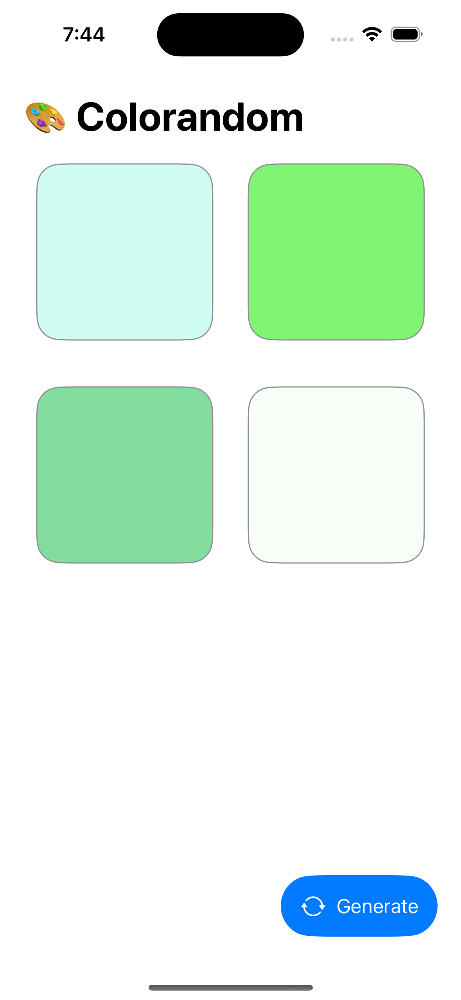
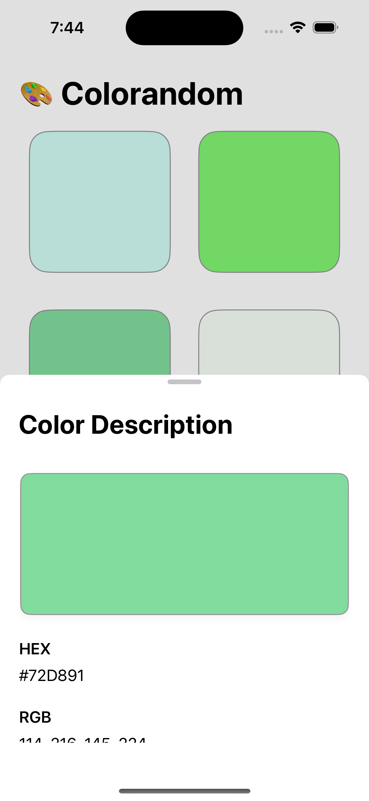
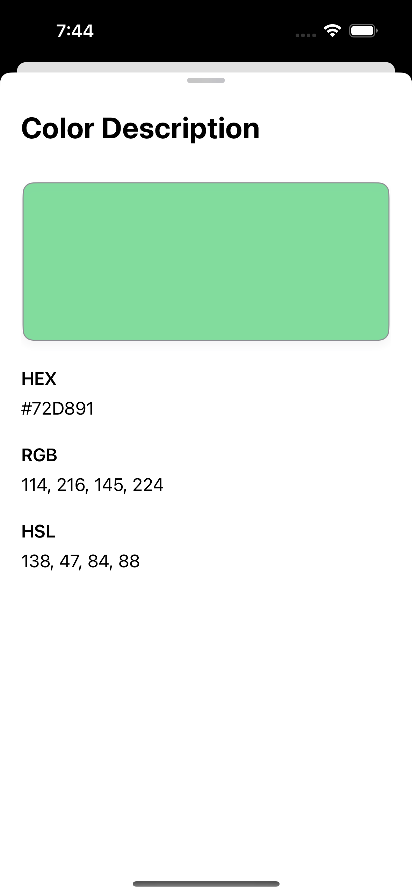

# Colorandom

Have you always thought about what color to choose? Don't think about choosing through color.

# Feature

- Create a color at random
- Generating a color code for the color generated

# Supported Color Codes

| Color Codes | HEX | RGB | HSB |   HSL   |
| :---------: | :-: | :-: | :-: | :-----: |
|   Support   | ✅  | ✅  | ✅  | Planned |

# Examples

  
  
  

